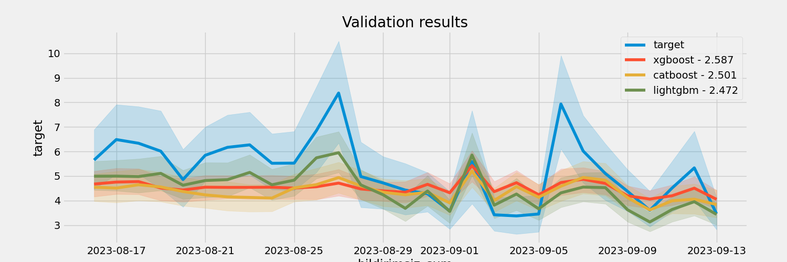

# GDZ Elektrik

#### Overview

This project contains scripts and utilities developed for the GDZ Elektrik Datathon 2024, aimed at forecasting electricity consumption. Our approach integrates multiple models including XGBoost, CatBoost, and LightGBM, leveraging extensive feature engineering and data preprocessing to enhance prediction accuracy.

#### Competition Link

For more details about the competition, datasets, and evaluation metrics, visit the [Kaggle competition page](https://www.kaggle.com/competitions/gdz-elektrik-datathon-2024?rvi=1).

#### Repository Structure

```
experiments/
│   ├── <timestamp>_submission.csv          - Predictions ready for submission.
│   ├── <timestamp>_val_plot.png            - Visualization of validation predictions.
│   ├── <timestamp>_yengecburger_kitchen.py - Script containing main logic for feature engineering and model training.
│   ├── <timestamp>_yengecburger_v4.py      - Utility scripts for various preprocessing tasks.
│   └── <timestamp>_log.txt                 - Logs generated during the experiment.
```

#### Running the Experiments

1. **Setup Environment**: Ensure Python 3.8+ is installed and set up a virtual environment.

   ```bash
   python -m venv yengecburger_env
   source yengecburger_env/bin/activate  # On Windows use `yengecburger_env\Scripts\activate`
   ```

2. **Install Dependencies**:

   ```bash
   pip install pandas numpy matplotlib seaborn xgboost catboost lightgbm scikit-learn scipy
   ```

3. **Execute the Script**:

   Navigate to the script's directory and run:

   ```bash
   python yengecburger_kitchen.py
   ```

   This will execute the experiment, logging the output and results in the `experiments` folder.

#### Viewing Results and Images

Results from the experiments, including prediction accuracy and feature importance plots, are saved in the `experiments` directory.

Sample plot below:



#### Additional Notes

- Ensure that all data files from the Kaggle competition are placed in the correct directories as expected by the scripts.
- Modify the `config_params` in the `yengecburger_kitchen.py` script to tune the experiment settings.

---

## **Old Logs:**

v20 3.0303951367781155 #num of valiadion windows 4 hyper params:default
v21 3.027355623100304 #num of valiadion windows 8 hyper params:default
v22 3.020516717325228 #num of valiadion windows 16 hyper params:default

v23 3.0364741641337387 #num of valiadion windows 4 hyper params:light
v24 3.234042553191489 #num of valiadion windows 8 hyper params:light
v25 3.0372340425531914 #num of valiadion windows 16 hyper params:light

v26 2.947568389057751 #num of valiadion windows 4 hyper params:default refit_full=TRUE
v27 2.9703647416413372 #num of valiadion windows 8 hyper params:default refit_full=TRUE
v28 2.981003039513678 #num of valiadion windows 16 hyper params:default refit_full=TRUE

v29 2.9506079027355625 #num of valiadion windows 2 hyper params:default refit_full=TRUE
v30 3.1603343465045595 #num of valiadion windows 1 hyper params:default refit_full=TRUE